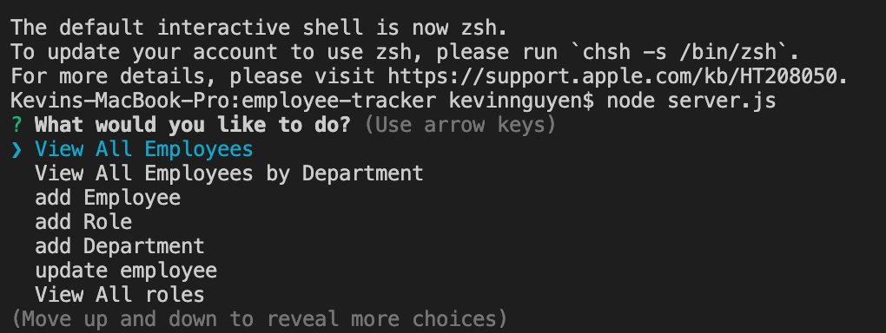
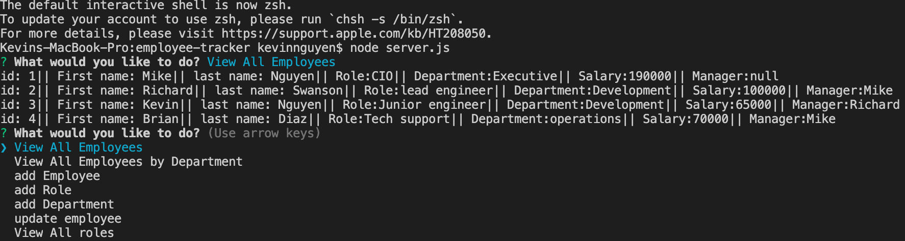
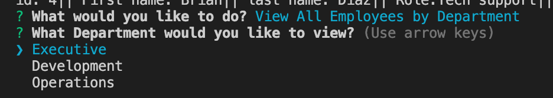
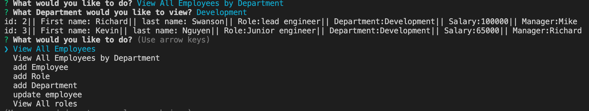
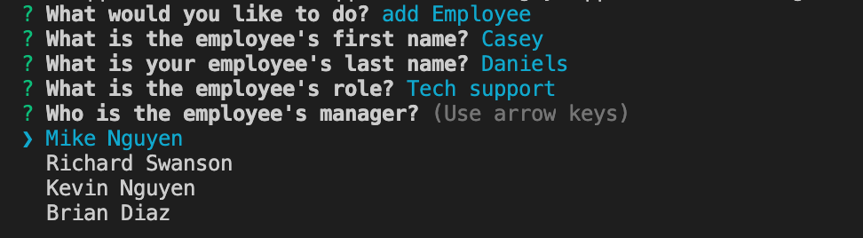
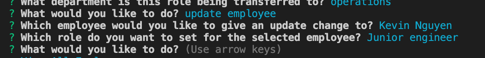
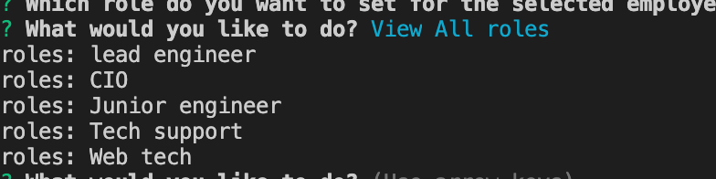
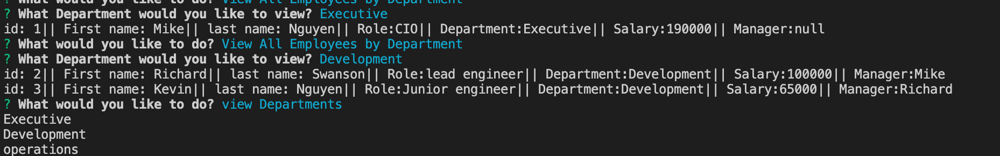

## Employee tracking system

## Description 
This project shows how I created an interface using node,inquirer, and mySQl. This assignment focuses on making it easy for non-developers to view their company information stored in a database.

In employee tracker you start off with a list of commands that you are able to run.

in the next command, "View All Employees" we are given a table where we are able to see a list of people working in the company as well as their id,role,department their in, salary, and who's their manager.

After, it prompts user with which department they wanted to reach and on display will be the department and who is in that specific department.

As the command  runs you are able to run with employees is viewing employees by department. After, it prompts user with which department they wanted to reach and on display will be the department and who is in that specific department.

On the next command you are adding a employee which will prompt you with a series of questions before printing it to our data.

in this one you are adding in a role

Another feature you are able to do in these commands is updating previous employees as well as ones that have been just added

view roles is displayed which will print out the specific roles in the company

view employees by department will prompt you with questions to see which department you want to be in and then it will display all employees within that department

## Table of contents

* [Installation](#installation)
* [Usage](#usage)
* [Questions](#questions)

## Installation
NPM install

## Usage
For non-developers to use for storing and viewing data

## Questions

If you have any questions about the repo, open an issue or contact ![Kvnvn] https://github.com/Kvnvn directly at Kevinvunguyen95@gmail.com

